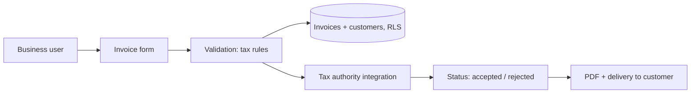

# Comprobante Express — Regulated E-invoicing Case Study

> Status: **in progress** · Sanitized: no tax IDs, invoices, credentials or production URLs.

A web product that lets small businesses issue electronic receipts and invoices compliant with the Peruvian tax authority (SUNAT).

## Problem
Micro-businesses need fast, compliant invoicing without desktop software or accounting knowledge.

## Constraints
- Tax-authority format and validation rules.
- Fiscal and personal data protection.
- Very simple UX for non-technical users.

## Solution

## Why it matters for Europe
The same discipline maps to **GDPR / LOPDGDD** for personal data and to Spain's **Veri*factu** / e-invoicing requirements: immutable records, traceability and validated submission.

## Documents
- [LEGAL-COMPLIANCE.md](LEGAL-COMPLIANCE.md)

## Omitted for confidentiality
Real invoices, tax IDs, customer data, provider credentials and endpoints.
